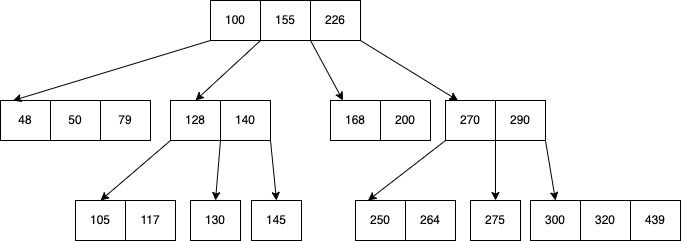
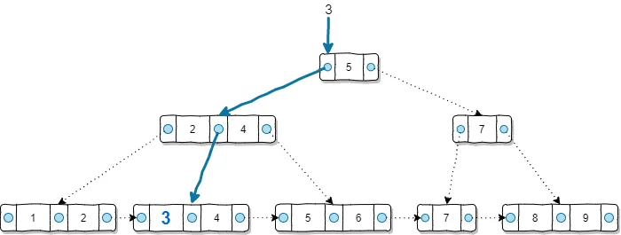
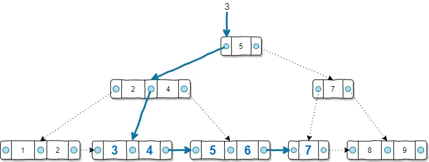

## Índice B-Tree

   - **Mejor caso de uso**: B-Tree es el tipo de índice predeterminado en PostgreSQL y es adecuado para la mayoría de las consultas de búsqueda. Es eficiente para columnas que se utilizan en operaciones de igualdad (por ejemplo, igualdad en columnas numéricas o de texto) y de rango.

   Supongamos que tienes una tabla llamada `empleados` y quieres buscar empleados por su número de identificación único (por ejemplo, el número de seguridad social):

   ```sql
   CREATE INDEX idx_btree_ssn ON empleados (numero_identificacion);
   ```

   En este caso, un índice B-Tree en la columna `numero_identificacion` sería eficiente ya que se utiliza en consultas de igualdad.


   


   Un árbol B-Tree almacena en cada nodo claves en orden ascendente. Cada una de estas claves tiene dos referencias a nodos hijo. El hijo de la izq tiene valores menores a la llave actual, mientras que el lado derecho tiene llaves mayores a la actual. El tiempo de busqueda es de **O(log(n))**

   Pero en una base de datos buscamos traer la información asociada a la llave. ¿Cómo se hace esto? 

   Se hace uso de un B+Tree.

   


   


