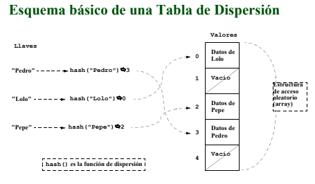
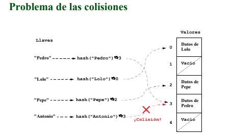

**Índice Hash**:
   - **Mejor caso de uso**: Los índices de hash son adecuados para igualdades exactas y búsquedas rápidas en valores con un alto grado de unicidad, como claves primarias.

   Si tienes una tabla `usuarios` y deseas buscar usuarios por su ID de sesión único (que es una cadena hash generada aleatoriamente):

   ```sql
   CREATE INDEX idx_hash_session_id ON usuarios USING hash (id_sesion);
   ```

   Los índices de hash son útiles cuando tienes un valor único y necesitas buscar exactamente ese valor.
   Están diseñados para proporcionar una búsqueda eficiente en tiempo promedio de O(1), lo que significa que la velocidad de búsqueda no depende del tamaño de la colección de datos. Su uso típico se da cuando tenemos una colección de valores donde cada uno tiene un identificador único, llamado llave o clave.

   Por ejemplo, considera un listado de alumnos con su información personal, donde se incluye el DNI. Como cada DNI es único, podríamos usar los DNIs como llaves en una tabla hash.

   Una tabla hash usa una función hash que se encarga de asociar cada llave con un número entero. A este número se le conoce como código de dispersión (hashcode) de la llave.

   Una tabla hash, en su implementación interna, consta de los siguientes componentes:

   1. Array: La tabla hash utiliza un array como estructura principal para almacenar los datos. El tamaño de esta se elige al crear la tabla. Cada casilla es una ubicación donde se pueden almacenar pares clave-valor.

   2. Función Hash: La función convierte una clave en un índice o ubicación en el array. La función hash toma la clave como entrada y devuelve un número entero (el índice) que representa dónde se almacenará el valor asociado a esa clave.

   En la siguiente imagen se muestra un ejemplo visual en el que el método hash recibe una clave y devuelva la posición del array que ocupan los datos de esa clave.

   

   3. Colisiones: Las colisiones ocurren cuando dos claves diferentes generan el mismo índice debido a la función hash.

   En la siguiente imagen se muestra un ejemplo visual de una posible colisión en la que la función hash devuelve la misma posición para dos claves. Esto es más probable que se de cuánto más lleno esté el array.

   

   4. Función de Dispersión Uniforme: Una buena función hash distribuye las claves de manera uniforme en las casillas para minimizar las colisiones. La dispersión uniforme es esencial para mantener un rendimiento constante.

   5. Factor de Carga: El factor de carga es la relación entre el número de elementos almacenados y la cantidad total de casillas. Mantener un factor de carga bajo (idealmente cercano a 1) es importante para evitar colisiones excesivas.

   6. Actualización y Eliminación: La tabla hash admite operaciones de inserción, actualización y eliminación de pares clave-valor. Cuando se actualiza una clave existente, se puede recalcular el índice utilizando la función hash y reemplazar el valor correspondiente   
   